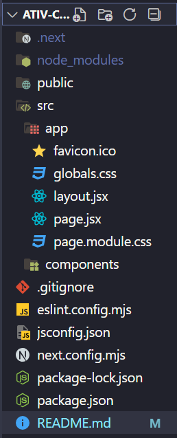

# 🧙‍♂️ Consumo de API do Harry Potter

## 📌 Sobre a Atividade

Aplicação web desenvolvida em React que consome a Harry Potter API para exibir informações sobre personagens do universo mágico. Interface responsiva, detalhes e tratamento de estados de carregamento e erro.

## Tecnologias Utilizadas

- **Next.js**: Framework para React que permite a renderização do lado do servidor.
- **Method**: `useState` e `useEffect` para gerenciamento de estado e efeitos colaterais.
- **Axios**: Biblioteca para realizar requisições HTTP.
- **CSS Modules**: Para estilização da aplicação.
- **Flexbox**: Para layout responsivo.

## Funcionalidades Implementadas

- Listagem de itens da API.
- Visualização detalhada de um item específico.
- Funcionalidade adicional: busca de itens.
- Tratamento adequado de estados de carregamento e erros.
- Interface responsiva.

## Estrutura de Pasta do projeto



## Instruções de Execução

1. **Clone o repositório**:

   ```bash
   git clone LINK DO REPOSITORIO

   ```

2. **Instale as dependências**:
   `npm install`

3. **Execute a aplicação**:

```bash
npm run dev
```

4. **Acesse a aplicação**:
Abra seu terminal e copie 'http://localhost:3000'
